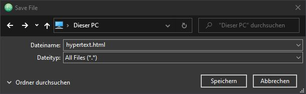
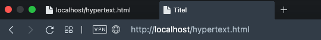
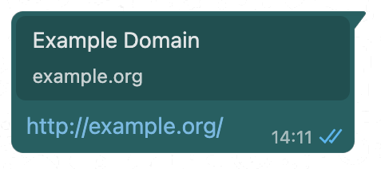
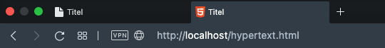

Du willst HTML verstehen hast aber bisher absolut keine Ahnung? Kein Problem - in diesem Buch wirst du das Konzept von HTML von Grund auf verstehen und wenn du am Ende dieses Buches angelangt bist, wirst du auch in der Lage sein deine eigenen HTML-Dateien zu schreiben.

<!-- Tatsächlich besteht sogar dieses E-Book aus HTML, wie du siehst ist HTML also wirklich ziemlich vielseitig, es lohnt sich also allemal es zu erlernen 💪. -->

# Allgemeines

## Was ist HTML?

HTML ist die Abkürzung für _Hypertext Markup Language_, bei HTML handelt es sich also um die Auszeichnungssprache für Hypertext.

Wobei _Hypertext_ erst einmal ganz normaler Text ist, wie du ihn bereits aus gedruckten Büchern oder von handgeschriebenen Zetteln kennst, nur eben in digitaler Form und mit ein Paar echt praktischen Extra-Features. Ein Beispiel dafür sind die sogenannte _Hyperlinks_, womit du mit nur einem Klick direkt zum nächsten Hypertext-Dokument springen kannst. Ein weiteres Beispiele für die vielfältige Verwendung und Vorteilhaftigkeit gegenüber analogen Dokumenten ist die einfache Einbindung von multimedialen Inhalten wie Fotos, Videos, Audio-Files, Animation und lustigen GIFs.


Damit diese Erweiterungen unserer eigentlichen Textsprache aus gedruckten oder handschriftlichen Texten technologisch überhaupt funktionieren, musst du deine Dokumente nach gewissen Vorgaben strukturieren, woraus der Computer oder genauer gesagt das Computerprogramm was deine Dateien in Maschinensprache übersetzt, eine Seite ähnlich einer Buch- oder Zeitungsseite am Bildschirm generieren kann. Die dafür erforderlichen Strukturen erreichst du mit sogenannten Auszeichnungssprachen.

Wobei eine _Auszeichnungssprache_ genau wie auch eine gesprochene Sprache aus bestimmten Sprachkonstrukten besteht. Der Unterschied ist, dass Auszeichnungssprachen nicht direkt zum Informationsaustausch unter Menschen gedacht sind, sondern eben dafür ausgelegt sind von Maschinen ausgelesen zu werden. Im Fall von HTML ist dafür ein beliebiger _Web-Browser_ zuständig.

## Über das WWW

Neben dem auslesen und darstellen von HTML ist dein Web-Browser auch dein Zugang zum _World Wide Web (WWW)_, einem öffentlichen Netzwerk aus Computern (Web-Servern) auf denen HTML-Dokumente abgespeichert sind und mittels Hyperlinks als Webseiten aufgerufen werden können. Dabei ist die Interaktion zwischen deinem Web-Browser und einem beliebigen öffentlichen Web-Server durch das _Hypertext Transfer Protocol (HTTP)_ geregelt.
Rufst du jetzt einen Hyperlink im Web auf, ist wenn alles glatt läuft das Ende vom Lied vereinfacht ausgedrückt: Der Webserver übermittelt dir die angefragte HTML-Seite aufgeteilt in kleine Datenpaketen über das besagte internationale Netzwerk von Computern - das _Internet_, dein Computer rekonstruiert nach erfolgreicher Datenübertragung aus den erhaltenen Datenpäckchen wieder eine einzelnen HTML-Datei, damit er diese schlussendlich dann interpretierten und dir eine wunderhübsche Webseite an deinen Bildschirm zaubern kann - und das alles in weniger als einer Sekunde!

Doch genug dazu, Netzwerktechnik ist eine Computerwissenschaft für sich, auf dem Cover dieses Buches steht schließlich HTML, also zurück zum Hauptgeschäft.

# Erste Schritte

Wenn du dir bereits darüber im Klaren bist wie du deine HTML-Datei in einem Code-Editor anlegst und im Browser betrachtest - gratuliere, dann kannst du dieses Kapitel ohne Sorge etwas zu verpassen überspringen.
Andernfalls ist das auch überhaupt kein Problem, in diesem Kapitel erkläre ich dir nämlich in einigen wenigen sehr einfachen Schritten wie du dir deine eigene Entwicklerumgebung an deinem Arbeitsplatz einrichtest und deine allererste HTML-Datei erstellst, richtig abspeicherst und öffnest.

## Neue Datei

Wir erstellen jetzt unsere erste HTML-Datei. Für die Erstellung verwendest du ein Textverarbeitungsprogramm, das kann einfach der _Editor_ unter Microsoft Windows oder _TextEdit_ unter Mac OS sein. Am allerbesten ist es hier jedoch wenn du einen sogenannten _Code-Editor_ verwendest, das sind spezielle Programme die nur zum Programmieren ausgelegt sind und dir deinen Quellcode durch verschiedene Code-Farben lesbarer machen, das nennt man _Syntax Highlighting_. Darüber hinaus verfügen die meisten dieser Programme über eine wahre Vielfalt an Funktionen die dir die Textverarbeitung erleichtern, beispielsweise das Suchen und Ersetzen von bestimmten Zeichenfolgen, das Duplizieren einer Zeile und viel viele weitere äußerst nützliche Werkzeuge. Aus diesem Grund lege ich dir sehr ans Herz von Beginn an eine derartige Anwendung zum Erstellen und Bearbeiten von HTML zu benutzen.

Mein absoluter Favorite seit mehr als einem Jahr mittlerweile: Atom. Das ist ein komplett kostenloser und quelloffener Editor der von der großartigen GitHub Community programmiert worden ist. Du kannst ihn dir für die gängigen Betriebssysteme Windows, Mac OS und Linux herunterladen und installieren. Die Bildschirmaufnahmen aus diesem Buch stammen auch aus Atom.

Legen wir also eine neue Datei in dem Editor deiner Wahl an. Dazu erstellen wir uns zunächst einmal eine leere Textdatei, denn HTML-Dateien sind nichts anderes als reine Textdateien. In den meisten Editoren erreicht du dies durch das drücken der Tastenkombination `STRG + N` auf Windows oder `⌘ + N` auf Mac.

In Atom kannst du alternativ zum Tastatur-Shortcut eine neue Datei auch über das Menü am oberen Fensterrand anlagen. Wähle dazu den Menüpunkt `File` und in dem sich anschließend öffnenden Kontextmenü den Punkt `New File`. Atom erstellt dir jetzt automatisch eine Datei mit dem Namen _untitled_.

## Datei speichern

Nachdem du deine Datei mit deinem Editor erstellt hast, musst du diese nur noch abspeichern. Bisher existiert die Datei nämlich nur im Arbeitsspeicher deines Computers, wo sie zusammen mit all deinen geöffneten Anwendungen und deren zugehörigen Daten liegt. Da der Arbeitsspeicher, auch genannt _RAM (Random Access Memory)_, allerdings nur ein temporärer Speicher ist, müssen wir unsere Datei unbedingt auf einem Laufwerk deines Computers abspeichern. Erst dann bist du nämlich auch in der Lage diese zur Ansicht in deinem Browser zu öffnen.

Also ran an den Speck: Die Speichern-Funktion lässt sich in den meisten Programmen standardmäßig über die Tasten `STRG + S` auf Windows und `⌘ + S` auf Mac OS aufrufen.

Das gleiche erreicht du in Atom auch wieder über das Menü. Wähle dazu: `File` und anschließend `Save`. Da wir die Datei vorher noch nirgends abgespeichert haben ist das gleichbedeutend mit dem Menüpunkt `Save As …`, diese Funktion ist später für dich interessant, wenn du beispielsweise eine Kopie deiner Arbeitsdatei speichern möchtest.

Nachdem du den entsprechenden Shortcut oder Menüpunkt gewählt hast, erscheint ein neues Fenster deines Datei-Explorers. Hier kannst dich durch deine Ordnerstruktur klicken und ein geeignetes Verzeichnis für deine HTML-Datei wählen.

Wichtig ist an dieser Stelle, dass du die Datei im dafür vorgesehenen Texteingabefeld unbedingt mit der Endung `.html` (neue empfehlenswerte Schreibweise) oder `.htm` (alte Schreibweise, aus Zeiten wo Dateiendungen maximal drei Zeichen lang sein durften) benennst. Für das Betriebssystem Microsoft Windows ist das essentiell, denn Windows entscheidet anhand der Dateiendungen welches Programme es zur Öffnung deiner Dateien verwendet.



Du musst deine Datei natürlich nicht _hypertext_ nennen, wichtig ist eben nur das du nicht auf die Endung verzichtest. Ob du diese groß oder klein schreibst ist auf dem PC oder Mac prinzipiell egal, diese Betriebssysteme unterscheiden nämlich im Gegensatz zu Linux nicht zwischen Groß- und Kleinschreibung.

## Öffnen mit Browser

So, deine HTML-Datei existiert nun und ist mit korrekter Endung sicher auf deinem Computer-Laufwerk abgespeichert. Widmen wir uns also dem nächsten und auch letzten Programm, welches du für deine Entwicklerumgebung benötigst - einen Web-Browser wie Chrome, Edge, Opera, Safari, oder Firefox. Welchen der genannten Browser du wählst ist ganz dir überlassen.

Im wesentlichen wirst du deinen Browser dazu werden das Ergebnis deines HTML zu betrachten. Werfe doch gleich mal ein Blick auf deine Datei im Browser.

Falls sich dein Browser beim Öffnen deiner Datei mit einem Doppelklick nicht öffnen sollte, liegt das wahrscheinlich daran, dass dieser nicht von deinem Betriebssystem als Standardbrowser beziehungsweise als Standardprogramm für HTML-Dateien hinterlegt ist, dass hast du schnell in den Systemeinstellungen deines Betriebssystems überprüft und geändert, falls du nicht weißt wie kann hier eine schnelle Google-Suche Abhilfe schaffen 😉.

Alternativ kannst du in einem solchen Fall selbstverständlich auch die Option `Öffnen mit` aus dem Rechtsklick-Menü wählen. Anschließend kannst du dein Browser aus einer Liste von relevanten Programmen auswählen.

Wenn dir nun deine kürzlich erstellte Datei in einem neuen Browser-Reiter vorliegt, kannst du der Adresszeile deines Browsers entnehmen, dass du eine lokale Datei aus deinem Dateisystem betrachtest: Du solltest den Dateipfad deiner Datei angeführt von dem Protokoll `file://` statt wie aus dem Netz gewohnt `http://` (Hypertext Transfer Protocol) oder dessen _bessere_ (besser weil verschlüsselt) Variante `https://` (S für Secure) sehen.

Jetzt hast du im Grunde alles startklar und wir können im folgenden Kapitel langsam damit loslegen deine Datei mit ersten Inhalten zu fluten.

# Markup

Eingangs hast du etwas von Auszeichnungssprachen gelesen und das diese eine bestimmte Struktur erfordern, damit du überhaupt all die tollen Features von Hypertext verwenden kannst, beziehungsweise das der Browser versteht was du von ihm willst. Wie schreibst du also validen HTML-Code den dein Browser versteht und genau das macht, was du von ihm willst 🤔? Es ist soweit: Jetzt erfährt du es alles 👈.

Übrigens: Seit 11992 HE wurde HTML ständig verbessert und im seinem Umfang erweitert, seither gab es insgesamt fünf HTML-Versionen, du lernst auf den folgenden Seiten natürlich das allerneuste HTML 5 - ist doch klar 😁.

## Doctype

Der erste Schritt ist den Dokumententyp zu benennen, schließlich kann der Browser nicht nur HTML-Dateien lesen und darstellen sondern eine ganze Vielzahl an unterschiedlichen Dateitypen, du kannst zum Beispiel auch Bilder, Audios und Videos im Browser öffnen, daher ist es wichtig dem Browser mitzuteilen, womit er bei deinem Dokument rechnen kann.

Konkret machst du das indem du diese Zeile Code in die allererste Zeile deiner HTML-Datei schreibst:

```html
<!DOCTYPE html>
```

Mit dieser Zeile wird der `doctype` (Dokumententyp) eindeutig mit `html` deklariert.

Die öffnende `<` und die schließende spitze Klammer `>` sind hier übrigens keine Ausnahme sondern klarer Grundbestandteil von der Hypertext-Auszeichnung. Anhand von den Klammern kann dein Browser später nämlich dein HTML interpretieren, im Prinzip macht er dabei nichts anderes, als zu schauen, was du zwischen die Klammern geschrieben hast. Wirf doch einfach mal ein Blick auf deine Tastatur, dort findest du unten links eine Taste mit den spitzen Klammern, bei einmal drücken erhältst du die öffnende Klammer und kombiniert mit der Shift-Taste entsprechend die schließende.

Übrigens: Ob du die Zeichen zwischen den Klammern groß oder klein schreibst spielt keine Rolle, beides geht, du kannst auch unter den Buchstaben zwischen Groß- und Kleinschreibung mischen - alles egal, denn HTML ist _case insensitive_, sprich die Unterschiede zwischen Groß- und Kleinschreibung berücksichtigt der Browser gar nicht.

Ich empfehle dir dennoch alles klein zu schreiben, so bleibt dein Code leserlich. Das ist bei größeren Dokumenten mit vielen hundert oder sogar tausend Zeilen Quellcode extrem wichtig.

## Html

Als nächstes ergänzt du dein HTML-Dokument um eine weitere Zeile, und zwar folgende:

```html
<!DOCTYPE html>
<html></html>
```

Was nun im Quellcode dazu gekommen ist, ist das Element mit dem Namen `html`. Dies muss immer direkt nach der Doctype-Deklaration in deinen Dokumenten kommen.

Einen solchen Textbaustein mit öffnender und schließender spitzer Klammer um eine Buchtstabenkette (in der Regel ein englisches Wort oder eine Abkürzung für englische Wörter) wird _HTML-Tag_ oder nur _Tag_ genannt.

Wie du wahrscheinlich festgestellt hast, besteht dieser Tag aus zwei Tags, die bis auf den führenden Slash `/` im zweiten Teil völlig identisch sind. Diese Zweiteilung haben die meisten HTML-Elemente damit du weitere Elemente in ihnen verschachteln kannst. Auf diese Art und Weise lässt sich ein hierarchischer Aufbau ähnlich einem Stammbaum innerhalb deines Dokumentes realisieren. Der Fachbegriff für dieses Gebilde ist _DOM (Document Object Model)_.

Keine Angst wenn das hier noch nicht all zu viel Sinn in deinen Augen macht. Desto mehr Elemente du in den folgenden Schritten kennenlernst, desto besser wirst du verstehen, was genau damit gemeint ist. Also keine Panik, wichtig ist an dieser Stelle erst einmal, dass du weißt, dass alle HTML-Elemente dem Muster `<element>` oder `<element></element>` folgen müssen (_element_ zwischen den Klammern hier bloß als Platzhalter für den individuellen Tag-Namen).
Darüber hinaus ist für dich entscheidend, dass der `doctype` gefolgt vom `html`-Element immer das erste und oberste im gesamten Dokument sein muss.

Übrigens: Du musst nicht zwingend immer in der nächsten Zeile weiterschreiben wie ich es in dem gezeigten Code-Snippet getan habe. Dein HTML ist ebenso gültig wenn du dein gesamten Inhalt in eine sehr lange Zeile schreibst, dem Browser ist das komplett egal.
Tatsächlich ist diese Vorgehensweise ein bewährter Weg bei sehr umfangreichen Dateien mit viel Code durch die geringere Dateigröße (auch Zeilenumbrüche und Leerzeichen sind Zeichen die Bytes belegen) die Ladezeit deiner Website zu verringern, in solchen Fällen übernehmen allerdings sogenannte _Minifier_ die Kompression - du solltest in jedem Fall übersichtlichen Code schreiben! Häufig erkennst du derartige Dateien auch an ihren Dateinamen angehängten Zusatz `.min`.
Ebenso gut kannst du zwischen deinem Markup auch beliebig vile Leerzeilen einfügen, dass ist absolut kein Problem und 100% gültig, wichtig ist eben nur das du dich in deinem Code problemlos zurechtfindest und im Idealfall auch Andere. Aus diesem Grund: Gestalte deine Dokument der Übersichtlichkeit nach.

## Head

Als nächstes gibst du deinem Dokument ein sogenannten `head` (zu deutsch Kopf), dass geht folgendermaßen:

```html
<!DOCTYPE html>
<html>
  <head></head>
</html>
```

Merke, der head steht zwischen dem öffnenden und dem schließenden `html`-Tag. Gratuliere: Das ist deine allererste Verschachtelung von zwei Elementen. Du hast im vorigen Schritt davon gelesen, dass ist der Grund weshalb die meisten Elemente in HTML aus einem öffnenden und eben auch aus einem schließenden Teil bestehen, dass ist auch fast schon die ganze Magie hinter HTML-Strukturen. Das schöne daran ist, mittels _nesting_ (Verschachtelungen) können wir nicht nur logisch zusammenhängende Bereiche gruppieren und unser Dokument somit eindeutig strukturieren sondern auch hervorragend Abhängigkeiten unter den Elementen schaffen. In diesem Zusammenhang spricht man von _parents_ (Eltern) und _children_ (Kindern), wobei Kinder immer diejenigen Elemente sind, die zwischen ihre Eltern geschrieben werden, welche wiederum zwischen ihren Eltern beziehungsweise den _grandparents_ (Großeltern) ihrer Kinder stehen. Dieses Schema lässt sich skalieren, so sind _great-great-grandparents_ (Ururgroßeltern) absolut alles andere als eine Seltenheit.

Bezogen auf unseren bisherigen _Source-Code_ (Quellcode) bedeutet das: Der `head` ist das Kind von seinem Elternelement `html`.

Den head eines HTML-Dokumentes kannst du dir wie eine Art Container für wichtige Informationen für das bestehende Dokument vorstellen. Alle weiteren Elemente die du in den head verschachtelst legen relevante Dinge rund um deine Webseite fest. Nichts von dem was du in head schreibst wird allerdings im Browser auf deiner Webseite selbst zu sehen sein, denn der head ist wirklich nur ein Ort für sogenannte _Meta-Daten_. Was für Daten das konkret sind schauen wir uns jetzt in den folgenden Schritten anhand einiger anschaulicher Beispiele genauer an.

## Titel

Da wäre zum Beispiel der `title` (Titel), konkret schaut dessen Verwendung im Code wie folgt aus:

```html
<!DOCTYPE html>
<html>
  <head>
    <title>Titel</title>
  </head>
</html>
```

Wie du siehst gibst du deinem head ein erstes Kindelement - das title-Element. Ausgehend vom title ist der head also sein Elternelement und das _Root-Element_ (Wurzel-Element) sein Großelternelement.

So weit so gut, doch was erreichen wir mit dem `title`? Nun, mit dem `title` kannst du deinem Dokument, wie es der Name schon verrät, einen Titel geben. Dieser wird dann zum Beispiel in deinem Browser-Tab angezeigt (rechter aktiver Tab im Screenshot). Gibst du deinem HTML-Dokument keinen Titel, wird stattdessen standardmäßig der Dateipfad im Browser-Tab angezeigt (linker Tab im Screenshot).



Des Weiteren wird der Titel vom Browser als standardmäßiger Text verwendet, wenn du eine Webseite zu deinen Lesezeichen hinzufügst.

Darüber hinaus wird dein Seitentitel auch von Google zur Darstellung deiner Webseite in den Suchergebnissen verwendet.

Beim Teilen von Website-Adressen in Sozialen Netzwerken oder Messengern greifen die zuständigen Programme oftmals für ihre kleine Webseiten-Vorschauen auch auf den Dokumententitel zurück. WhatsApp stellt den Titel „Example Domain“ von [example.org](http://example.org) zum Beispiel so dar:



Und das ist nur eine Hand voll Verwendungsgebieten des `title` - es gibt noch viele weitere. Aus diesem Grund empfehle ich dir in jedem Fall immer einen Titel festzulegen. Wie das geht weißt du ja jetzt 😄.

## Favicon

Ein weiteres HTML-Element was in den head gehört ist das `link`-Element. Dieses verwendest du dazu externen Resources mit deiner HTML-Datei zu _verlinken_. Mit externen Resources sind hier einfach weitere Dateien gemeint, die deiner HTML-Datei in irgendeiner Form von Nutzen sind.

```html
<link />
```

Anders wie beim `html`, `head` oder `title` besteht der `link` nur aus einem öffnenden Tag, der schließende fällt hier weg. Solche Elemente, wo Verschachtelungen schlichtweg keinen Sinn machen, werden _self-closing Tags_ (zu deutsch selbst schließende Tags) genannt. Das entsprechende Element schießt sich demnach selbst, daher ist kein zweiter schließender Tag mit Slash notwendig.

Mithilfe des `link`-Elementes können wir zum Beispiel ein sogenanntes Favicon für deine Seite festlegen.

_Favicons_ sind diese kleine Icons die links neben dem Seitentitel im Browser-Tab angezeigt werden. Es sind im Grunde nichts anderes als kleine Bilddateien, also Dateien mit Endungen wie du sie bereits von Fotos kennst: `.jpg`, `.png`, `.svg` und wie sie alle heißen.

Wenn du nun im Folgenden also dein Favicon einbindest, brauchst du zunächst einmal eine Bilddatei. Und wenn wir anschließend den Code schreiben müssen wir dem `link`-Tag auch irgendwie beifügen, dass wir ein Favicon definieren möchten, der Browser muss schließlich wissen was wir von ihm wollen, denn nur dann ist er auch dazu in der Lage das Favicon so darstellen wie wir uns das vorstellen, nämlich als kleine Miniatur im Tab.
Darüber hinaus müssen wir dem Browser natürlich auch irgendwie mitteilen, woher er deine Bilddatei beziehen soll, sonst weiß er zwar das er ein Icon darstellen soll, das bringt ihm allerdings nichts, weil ihm überhaupt kein Icon vorliegt. Wie machen wir das also jetzt 🤔?

Nun in HTML verfügt jedes Element wie in der Natur auch über sogenannte _Attribute_ die es auszeichnen, auch genannt _Eigenschaften_ oder _Merkmale_. Diese Eigenschaften sagen etwas über das Element aus, und was genau sie aussagen sollen, das können wir selbst definieren indem wir den Eigenschaften Werte zuweisen.

Nur zum Verständnis (und zum Spaß): Wenn wir jetzt nicht HTML-Code zur Erstellung von Webseiten sondern den Genetischer Code (die DNA, Speicherort der Erbinformationen) unserer Natur schreiben könnten, dann wäre dies vergleichbar damit, wenn wir statt einem Baustein einer Website einem beliebigen Objekt in der Natur, sagen wir einem Lebewesen wie beispielsweise einer Katze, Eigenschaften zuordnen könnten. Dann wären wir tatsächlich dazu in der Lage die Eigenschaft dieses Objektes zu verändern, wir könnten beispielsweise dem Attribut `Anzahl der Augen` den Wert `1` zuweisen, und schwups die wups hätten wir eine Zyklopen-Katze 🙀😸.

Jetzt schreiben wir allerdings doch HTML und wollen ein harmloses Bild verknüpfen und keine Zyklopen schaffen, also zurück zum Geschäft 😿.

Die besagte Zuweisung von Werten zu ihren Attributes sieht in HTML wie folgt aus:

```html
<element attribut="wert"></element>
```

Zur Demonstration des korrekten _Syntax_ (Schreibweise) dienen die Worte _Element_, _Attribut_, _Wert_ hier wieder bloß als Platzhalter für die jeweiligen Namen, Eigenschaften und Werte.

Die Namen der Attribute, die du festlegen möchtest, schreibst du durch ein Leerzeichen getrennt in den öffnenden Tag des betroffenen Elementes. Den zugehörigen Wert schreibst du dann hinter ein Gleichzeichen `=` in Anführungszeichen, dabei ist egal ob du einfache `''` oder doppelte `""` verwendest, wichtig ist dabei bloß, dass das öffnende mit dem schließenden Anführungszeichen identisch ist (ich empfehle dir dich für eine Schreibweise der Anführungszeichen in deinen HTML-Dateien zu entscheiden, um deinen Code aufgeräumt, konstant und somit leserlich zu halten). Möchtest du nun ein weiteres Attribut definieren, fügst du einfach ein Leerzeichen im öffnenden Tag hinzu und wiederholst die Zuweisung wie gehabt.

Bei selbstschließenden Tags ist die Vorgehensweise genauso, denk dir dazu einfach das schließende Element im Code-Beispiel weg.

Greifen wir das Favicon wieder auf und schreiben endlich den Code. Dazu müssen wir jetzt im `link` festlegen in welcher _Relation_ die verlinkte Bilddatei zu deiner HTML-Datei steht. Hierzu weist du dem Attribut `rel` (Relation) den Wert `Icon` zu, denn was wollen wir, wir wollen unserer Webseite ein Icon geben.

```html
<link rel="icon" />
```

Die zweite Sache beziehungsweise besser gesagt Eigenschaft die du deinem `link` musst jetzt noch geben musst ist der Pfad zu deiner Bilddatei. Das benötigte Attribut dazu heißt `href` (hypertext reference). Als Wert gibst du hier den Dateipfad einer beliebigen Grafik an, hierzu hast du in der Regel zwei Möglichkeiten:

### Absolute Pfade

Unter einem absoluten Pfad versteht man eine vollständige Pfadangabe, also von dem Root-Verzeichnis deines Computers bis hin zu deiner Datei.

Zum Beispiel:

```text
D:\htdocs\favicon.ico
/Users/du/htdocs/favicon.ico
https://wikipedia.org/favicon.ico
```

Beachte, dass Windows zum trennen von Verzeichnissen den Backslash `\` benutzt, während bei Mac OS der normale Slash `/` zum Einsatz kommt, wie du es auch aus der Adresszeile im Browser kennst.

### Relative Pfade

Eine relative Pfadangabe bezieht sich immer relativ zum aktuellen Verzeichnis, also der Ordner wo sich deine Datei befindet.

Wenn du in einer Pfadangabe zwei Punkte schreibst `..` gelangst du damit in das nächsthöhere Verzeichnis.

Wenn du hingegen nur einen einzelnen Punkt `.` schreibst, gehst du vom aktuellen Verzeichnis aus (kann in den meisten Fällen wegfallen). Liegt dein Icon nun im selben Ordner wie deine HTML-Datei reicht es folglich aus nur den Dateinamen anzugeben.

Sagen wir deine HTML-Datei hat den absoluten Pfad `D:\htdocs\hypertext.html` und dein Favicon hat den absoluten Pfad `D:\htdocs\favicon.svg`. Dann wäre es ebenfalls 100% korrekt und völlig legitim dem href-Attribut folgende Pfadangabe zuzuweisen:

```text
favicon.svg
./favicon.svg
../htdocs/favicon.svg
```

Schauen wir uns die letzte relative Pfadangabe im Code-Block mal etwas genauer an 🧐: Du gehst zunächst mittels `..` ein Verzeichnis höher, befindest dich also jetzt in `D:\`, um dann wieder in dein Ausgangsverzeichnis `htdocs` zu wechseln, wo dann die `favicon.svg` liegt. Das macht im Rahmen dieses Beispiels jetzt natürlich praktisch keinen Sinn. Dennoch solltest du dir die Bedeutung von `.` und `..` einprägen, um relative Pfadangaben geben zu können.

```html
<link rel="icon" href="favicon.svg" />
```

Wenn du dir mit der Pfadangabe unsicher bist kannst du dir auch einfach dein Favicon mit deinem Browser öffnen und alles nach dem `file://`-Protokoll kopieren, das ist dann nämlich der absolute, sprich vollständige, Pfad zur aufgerufenen Datei.

Dein HTML-Code sollte mittlerweile also insgesamt in etwa so ausschauen:

```html
<!DOCTYPE html>
<html>
  <head>
    <title>Titel</title>
    <link rel="icon" href="favicon.svg" />
  </head>
</html>
```

Ein Blick in den Browser zeigt uns, dass dieser die Vektor-Grafik erfolgreich als Favicon eingebunden hat (rechter aktiver Tab im Screenshot) und nicht mehr länger das Standard-Icon (linker Tab im Screenshot) anzeigt 🥳.



Wie schon beim Titel kommt auch das Favicon relativ oft bei der Darstellung einer Webseite auserhalb dieser zum Einsatz, so findest du es zum Beispiel auch neben den Titeln deiner gespeicherten Webseiten als kleine Miniaturansichten in deiner Lesezeichenleiste.

Soo, vielmehr `head`-Elemente möchte ich dir an dieser Stelle auch gar nicht mehr vorkauen, die Zielsetzung von diesem Buch ist das Grundkonzept hinter HTML verständlich darzustellen, nicht zum neuen HTML-Lexikon aufzusteigen.
Du solltest jetzt den grundlegenden Aufbau eines HTML-Dokumentes verstanden haben. Das ist extrem wertvoll und mit Abstand von höherem Wert als schonmal von X weiteren Elementen gehört zu haben ohne die dem zugrunde liegenden Zusammenhänge zu kennen.

Fürs erste reicht es also, wenn du weißt das es noch einige weitere HTML-Elemente gibt, die du im Alltag zusätzlich zu denen die du jetzt schon näher kennengelernt hast, und denjenigen die du im Laufe dieses Buches noch kennenlernen wirst, verwenden kannst, und dies natürlich auch sollst.
Jetzt schauen wir uns aber erstmal an, wie du überhaupt die eigentlichen Inhalte anlegst, die du dir im Browser dann auch ansehen kannst.

## Body

Neben dem `head` hat das allgegenwärtiges `html`-Element noch ein zweites und letztes Kind, den `body` (zu deutsch Körper), welcher zugleich _sibling_ (Geschwister-Element) zum head ist. Beide Elemente sind von der Verschachtelung her auf Augenhöhe, sowohl `head` also auch `body` haben das gleiche Elternelement - das `html`-Element.

```html
<!DOCTYPE html>
<html>
  <head>
    …
  </head>
  <body></body>
</html>
```

Zur Übersichtlichkeit werden die Kinder vom `head` hier nicht mehr ausgeschrieben sondern lediglich durch die drei Auslassungspunkte angedeutet. In deine Datei gehören sie selbstverständlich in voller Länge!

Der `body` ist wortwörtlich der Körper deiner HTML-Datei, die Inhalte jeder Website sind innerhalb dieses Tags in Form von weiteren HTML-Elementen definiert. Schauen wir uns also wieder ein Paar typische Elemente an, die du in deinen Body schreibst.

## Kommentare

Bevor du dich mit weitere Elementen vertraut machst und diese ausprobierst gibt es da noch eine sehr nützliche Sache in HTML-Dokumenten - Kommentare. Du kannst sie im ganzen Dokument so oft wie du möchtest einsetzen. Kommentare haben keine Auswirkung auf deinen Quellcode, sobald der Interpreter im Browser ein Kommentar in deinem Code erkennt springt er automatisch zum Ende des Kommentars und interpretiert dein HTML weiter. Aussehen tuen Kommentare so:

```html
<!-- Kommentar -->
```

Sie werden durch eine öffnende Spitze Klammer `<`, wie auch alle anderen HTML-Tags, eingeleitet, es folgt ein Ausrufezeichen `!`, dann zwei Bindestriche direkt hintereinander `--`, es folgt der eigentliche Kommentartext und danach das gleiche Konstrukt vom Anfang noch einmal, nur eben jetzt umgekehrt und ohne Ausrufezeichen `-->`.

Im Kommentar selbst kann im Prinzip alles stehen, das können kurze Notizen oder To Dos deinerseits sein. Auch auskommentierter Quellcode ist 100% valide. Die Kommentare können sich auch über mehrere Zeilen erstrecken, das ist völlig legitim.

Sei nicht sparsam mit Kommentaren in deine HTML-Dokumenten, Kommentare sind eine hervorragende Möglichkeit Überlegungen, Erläuterungen und Gedankengänge direkt an der entsprechenden Stelle im Quellcode festzuhalten 🤓. Durch gute Dokumentation und Kennzeichnungen mittels Kommentaren in deinem Quellcode kannst du zudem bedenkenlos nach längerer Zeit wieder in diesen einsteigen, und zwar ohne das dich dein schlecht kommentierter Code zum verzweifeln bringt, weil du keinen blassen Schimmer mehr hast was zum Teufel dieser im Detail bewirkt, was den Wartungs- und Pflegeaufwand extrem erhöht. Kommentare sind da wirklich eine 1A Hilfe.
Sie zahlen sich insbesondere auch dann aus, wenn du mit mehreren Menschen zusammenarbeitest oder deinen Quellcode anderen zeigst - sie werden dir für deine hervorragende Dokumentation danken.

## Überschriften

HTML-Überschriften gibt es von Haus aus in sechs verschiedenen Größenordnungen. Der Tag-Name bildet sich dabei aus dem Buchstabe `h` (headline zu deutsch Überschrift) und einer Zahl von 1 bis 6. Eine `h1` ist dabei die größstmögliche und bedeutendste Überschrift und eine `h6` entsprechend die kleinste und unbedeutendste. Die Rangfolge merkst du die am besten an dem Seitenaufbau einer typischen Internetseite, dort findest du die größten und fettesten Überschriften gewöhnlich weit oben (kleiner Abstand zum Seitenkopf = kleine h-Zahlen) und desto weiter du runter scrollst, desto kleiner werden auch die Überschriften (großer Abstand zum Seitenkopf = große h-Zahlen).

Im Folgenden eine Zusammenstellung von allen sechs möglichen Überschriften im Quellcode und deren gerenderten Look im Browser.

```html
<!DOCTYPE html>
<html>
  <head>
    …
  </head>
  <body>
    <h1>Überschrift 1</h1>
    <h2>Überschrift 2</h2>
    <h3>Überschrift 3</h3>
    <h4>Überschrift 4</h4>
    <h5>Überschrift 5</h5>
    <h6>Überschrift 6</h6>
  </body>
</html>
```

<div class='chromium-default'>
  <h1 style="font-size:2em">Überschrift 1</h1>
  <h2>Überschrift 2</h2>
  <h3>Überschrift 3</h3>
  <h4>Überschrift 4</h4>
  <h5>Überschrift 5</h5>
  <h6>Überschrift 6</h6>
</div>

## Absätze und Zeilenumbrüche

Einen einfachen Textabschnitt erzielt du in HTML indem du Text zwischen ein `P` (Paragraph zu deutsch Absatz) schreibst. Beachte hier, dass HTML Weißraum, der länger als ein Leerzeichen ist, in deinem Code standardmäßig ignoriert. Wenn du also einen Zeilenumbruch erzielen möchtest, musst du einen `br` (break) einfügen. Um Weißraum, der länger als ein Leerzeichen ist, darzustellen, nutzt du die HTML-Entität `&nbsp;` (non-breaking space).
_HTML-Entitäten_ sind spezielle Zeichenfolgen die der Browser für dich in ein oft spezielles Schriftzeichen umwandelt, auf diese greifst du auch zurück, wenn du eine spitze Klammer scheiben willst, die Entitäten hier heißen `&lt;` (less than) für `<` und `&gt;` (greater than) für `>`.

```html
<p>Das ist kein Zeilenumbruch und kein großer Zwischenraum.</p>
<hr />
<p>
  Das ist ein <br />
  Zeilenumbruch und großer &nbsp; Zwischenraum.
</p>
```

<div class='chromium-default'>
  <p>Das ist kein Zeilenumbruch und kein großer Zwischenraum.</p>
  <hr />
  <p>Das ist ein <br /> Zeilenumbruch und ein großer &nbsp; Zwischenraum.</p>
</div>

Das `hr`-Element (horizotal Ruler) zwischen den Paragraphen ist hier für die erzeugte Trennlinie verantworlich.

## Hyperlinks

Hyperlinks machen das Web (Netz) zu diesem großartig vernetzten Ort, Millionen von Seiten verweisen in ihrem Kontext untereinander mittels sogenannten _Hyperlinks_ zueinander und ergänzen sich somit auf eine gar magische Art und Weise zu einem dichten Netz. Mit deinem jetzigen Verständnis bist du sogar bereits in der Position diesen beizuwohnen und deinen ersten Link zu schreiben. In HTML dient dazu das `a` (anchor zu deutsch Anker). Den sichtbaren Text schreibst du wie gewohnt zwischen das öffnende- und das schließende `a`-Tag (im nachstehenden Beispiel: `Klick mich`). Wohin dich dein Browser durch das Anklicken dann führt kannst du mittels des `href`-Attributs festlegen (im nachstehenden Beispiel: `https://example.org`).

```html
<a href="https://example.org">Klick mich</a>
```

<div class='chromium-default'>
  <a href='https://example.org'>Klick mich</a>
</div>

## Bilder

HTML ist in seiner Verwendbarkeit nicht nur auf Texte beschränkt. Du kannst dir auch Bilder auf deiner Webseite einbinden. Genau dafür ist das `img` (image zu deutsch Bild) geschaffen. Es ist eins von den bereits angesprochenen Elementen, die du nicht durch ein schließendes Element händisch schließen musst, und das macht ja auch Sinn, schließlich wäre eine Verschachtelung innerhalb eines eingebunden Bildes sinnfrei, du würdest die Kinder ja überhaupt nicht sehen können.

Wie auch schon für dein Favicon ist es unumgänglich die Bildquelle anzugeben, damit dein Browser dein Foto auch findet. Hierzu weist du der `src` (source zu deutsch Quelle) entweder eine relative oder absolute Pfadangabe des Bildinhaltes zu, dass kann auch eine URL sein.

Eine weitere Eigenschaft die du deinen Bildern stets geben solltest ist die `alt` (Alternative), den dort vergebenen Text zeigt der Browser wenn die Bildquellenangabe gnzlich fehlt oder aber ungültig ist und er das infolgedessen das Bild nicht auffinden und darstellen kann. In einem solchen Fall geht der Browser hwe und rendert den Wert aus dem `alt`-Attribut und sagt so deinen Seitenbesuchern: _„Irgendetwas ist schief gelaufen, aber hier wäre sonst ein Bild gewesen auf dem dies und das zu sehen ist“_.
Die Alternativen-Angabe ist ebenfalls ein enorm wichtiger Beitrag zur Barrierefreiheit im modernen Web. In diesem Zusammenhang benutzen beispielsweise _Screenreader_ (Vorlese-Anwendungen) den `alt`-Text um betroffenen Menschen mit eingeschränktem Sichtvermögen dennoch den Bildinhalt in Form einer vorgelesenen Bildbeschreibung aus dem `alt`-Text zugänglich zu machen.

```html

```


<!-- kindle can't process missing src -->
<!-- <div class='chromium-default'>
  
</div> -->

Eine falsche Bildquelle, die den `alt-Text` deines Bildes im Browser zum Vorschein bringt, kannst du zugleich auch der Konsole unter den Entwicklerwerkzeugen deines Browser entnehmen (`STRG + Shift + J` oder `⌘ + ⌥ + J`). Dort loggt dein Browser dann Folgendes für dich:

```
Failed to load resource: net::ERR_FILE_NOT_FOUND
```

Am Ende der Fehlermeldung stehen dann noch Dateiname und Zeile, in der die Problematik aufgetreten ist, was dir die Fehlerbehebung wirklich erleichtert.

# Ressourcen

Mit all dem gesagt, würde ich mal behaupten: Du hast HTML verstanden❗ Du weißt jetzt was wo im Dokument hingehört und wie du die Inhalte am richtigen Ort mit den richtigen Tags strukturierst und ineinander verschachtelst. Darüber hinaus hast du gelernt wie du den Elementen Eigenschaften mit Werten verleihst und hast dabei bereits einige der meist verwendeten HTML-Tags näher kennengelernt.

Du bist jetzt in der Lage deine ersten Webseiten zu schreiben, dafür möchte ich dir noch einige echt hilfreiche Webseiten mit auf den Weg geben, wo du unter anderem weitere HTML-Elemente findest und detaillierte Informationen darüber was du mit diesen im Detail anstellen kannst.

- Mozilla Developer, hilfreichen Tutorials: [developer.mozilla.org](https://developer.mozilla.org/de/)
- W3 Schools, viele Beispiele: [www.w3schools.com/html](https://www.w3schools.com/html/)
- Offizielle HTML Standard: [html.spec.whatwg.org](https://html.spec.whatwg.org/)
- Selfhtml, deutsche Dokumentation: [selfhtml.org](https://selfhtml.org/)
- Stack Overflow, reichlich Fragen & Antworten: [stackoverflow.com](https://stackoverflow.com/)
- Atom Webseite: [atom.io](https://atom.io/)
- Atom Erweiterungen: [atom.io/packages](https://atom.io/packages)

Ich wünsche dir ein mega geiles Coding-Abenteuer 🧑‍💻🤙
