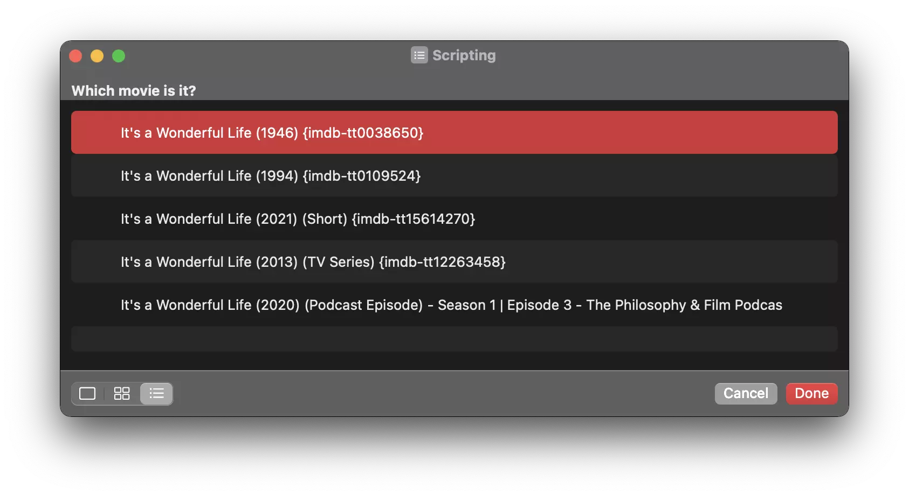
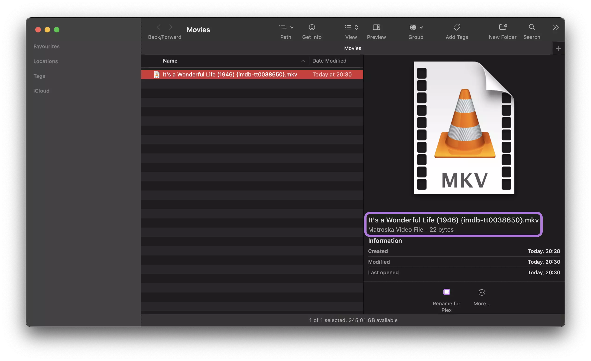

[Plex media servers](https://www.plex.tv/media-server-downloads/) are awesome to host own collections of movies and TV shows. The user interface is supreme, and you do not have to care about keeping your drive tidy because Plex gives you this friendly interface. But wait, there is only one thing — you have to make sure all your files including movies and TV shows etc. are named correct, so Plex will be able to index them correctly.

Renaming files doesn't sound like a big job but can get really annoying when you have to rename lost of files. As Plex works best with files named in a specific structure, you have to follow their [guidelines](https://support.plex.tv/articles/naming-and-organizing-your-tv-show-files/) here.

According to their docs, it's recommended to apply the following for minimum:

1. Title of the media, either of the movie or of the TV show
2. Year of release 

So at the end you need something like `Title (Year).mp4`.

Which practically will give you something like `It's a Wonderful Life (1946).mkv`.

When you want to have complete accurate named filenames, you should attach unique IDs of the media referencing global movie databases like the *[Internet Movie Database](https://imdb.com)* a.k.a. IMDb, owned by Amazon.

To add those IDs to your files, you have to add a pair of curly brackets `{}` at the end of your filename (before the file extension, like `.mkv` for a *[Matroska Multimedia Container](https://en.wikipedia.org/wiki/Matroska)*). In those brackets you first define the database hosting service (for example `imdb` for the IMDb) followed by a hyphen `-` and finally the record identification (for an IMDb record that's for example `tt0038650`).

To put all that together, you got something like `{imdb-tt0038650}`, which in a full examples equals `It's a Wonderful Life (1946) {imdb-tt0038650}.mkv`.

Properly, you ask yourself how the heck do I get this identification? Well,  it's not that difficult can simply go ahead to [imdb.com](https://imdb.com), search for a movie or show and have a look into your browsers address bar. You will see, the ID is part of the URL: [https://www.imdb.com/title/**tt0038650**/](https://www.imdb.com/title/tt0038650/). 

Make sure you have configured your browser to show the full URL by default in your search bar. Otherwise, simply click into the bar, that should give you the full URL as well. In Chrome, you can simply right-click your search bar and check the option named *“Always Show Full URLs”*.

Don't worry too much about these IDs right now. Instead, stay tuned! I have a better option for you to get those IDs into your filenames without even opening your browser or any other application on your machine when renaming your files.

So to get this information into your filename, you have to accomplish a handful steps. You basically have two different options here, you can get the job done manually, or you let the software run all the annoying tasks for you.

## Manually

It's a workflow of typing or copying the filename over to your browsers search engine to collect all details you need: the correct release title and the release year. 

1. Now you also have to either remember the information or copy them to your clipboard
2. to be able to paste/type them in your file system and also meet the formatting requirements.

### Advantages

* Costs you **no money**

### Disadvantages

* Costs you **a lot of time** and lets you feel you are wasting our valuable time
* **Low-quality** results with no indexing guarantee when you do not add database IDs like those from the IMDb

## Automatically

An automated solution is an automatic process which fetches matching entries from the IMDb by performing a search request using the filename of the file you selected in your file explorer. To give you the most relevant results, the filename gets prepared by striping unnecessary periods and dashes and replaces them with spaces. Then you get a short list of the top matches and can choose the one which is the absolute right match. The file gets renamed and et voilà — that's it!

### Advantages

* Reduces the amount of time used **enormously**
* **High-quality** results (full Plex support by providing full IMDb Ids)

### Disadvantages

* Costs you a **few** bucks
* Needs **one-time** basic setup and configuration (easy)

## Get your automation!

So you have chosen the automated process, right?  — Good decision! (I decided so too 😄)

The automated process makes use of the built-in Shortcut app of your Mac, which allows a seamless experience by direct Finder integrations.

So the only thing to do to get started with your workflow automation is buying the shortcut, directly downloading it and dropping it into your system.

Get your automation **[here](https://store.wolf.gdn/b/vSKRH)** for a single one time payment of €5.00. 

  

Note that you are allowed to install the shortcut on all of your personal devices — there is no device limitation. Feel free to level up all of your machines!

## Shortcut

Look how easy the whole process of file naming and handling gets. You do not even have to leave your file system and doing a Google search or look up on the Internet Movie Database yourself.

### What you need

* A Mac/MacBook running on [macOS Monterey](https://www.apple.com/macos/monterey/) (Version 12.0.0 upwards)
* API Key for the Internet Movie Database, you can get one for free [here](https://imdb-api.com)

### Usage

In your Finder when you select a file, you will notice a new action right under the file details in the preview panel called *“Rename for Plex”*. By clicking here, you will kick up the whole automation process.

After the automation started and processes the filename and running a search and finally receives possible matches for your file, you are prompted to choose the one which matches your file best.

You will see how your selected files gets renamed with the matching entry you just selected imediatly after conforming your selection:

### Installation

Don't worry — the installation is not a big deal, you just have to get the .shortcut file on your system and import in to your `Shortcuts.app`.

To do so, you can just double-click the `.shortcut` to open it in your `Shortcuts.app`.

If you have the shortcuts Application already opened, you can use the desired menu path ending in *Import* too.

### Configuration

During installation inside the `Shortcuts.app` you are asked a few questions. To sum up these questions are all about:

* Mode/environment you want the shortcut to run in

  * Either `Development`
  * or `Production`
* Your IMDb API key, required to fetch matching results from IMDb

#### Environment

Environment value defaults to Production. Alternatively you can change the shortcut to run in development mode by proving a value of dev here.

##### Production

In Production mode, you will receive important milestones in the flow of the automation process as system notifications popup up on the right of your screen.

##### Development

If you run in development mode instead, you will receive those core steps in the automated process as alert boxes, so you get a good view of the contents which are processed. Also, you can press *Cancel* to stop the automation from running, which gives you full control of the way the shortcuts processes.