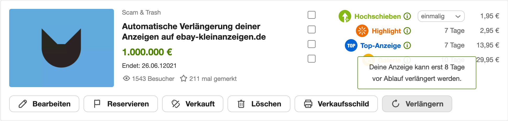

:toc:

Deine Anzeigen auf eBay Kleinanzeigen sind regulär 60 Tage online und verschwinden danach komplett von der Plattform. Das ist bei Kleinanzeigen unantastbares Gesetz, die einzige Möglichkeit die die die Betreiber hier bieten, deine Anzeigen über die 60 Tage hinaus online zu behalten, ist die Verlängerung. Diese kann grundsätzlich über zwei unterschiedliche Wege erfolgen.

1. Über den _„Verlängerungs-Button“_ unter `Meins > Anzeigen` bei der jeweiligen Anzeige innerhalb der Web-Anwendung
2. oder den _„Verlängerungs-Link“_, den du eine Woche vor Ablauf deiner Anzeige via Mail erhälst

// image::mail.png[Verlängerungs-Mail, width=50%]

Möchtest du den lästigen Prozess der manuellen Anzeigen-Verlängerung über einen der beiden beschriebenen Wege übergehen, aber gleichzeitig trotzdem immer deine Anzeigen online haben, müssen wir darauf zugreifen, und diese Interaktionen programmtechnisch auslösen.

== Automation

Ich habe mich dazu entschieden über den zweiten Weg zu automatisieren, denn hier gibt eBay Kleinanzeigen bereits den Auslöser, wann eine Verlängerung möglich ist, und wir müssen uns in dem Moment nicht mehr darum kümmern.

Konkret bedeutet dies, dass wir unseren Posteingang auf das Eintreffen von Verlängerungs-Mails überwachen müssen (Auslöser), und sobald diese eintreffen, eine bestimmte Aktion in Gang setzen, die

1. den Verlängerungs-Link findet
2. und diesen aufruft und dadurch die Anzeige verlängert.

=== Eintreffende Mails identifizieren
Damit wir nicht jede eintreffende E-Mail verarbeiten, sonder eben nur die, die wir für unser Vorhaben auch gebrauchen können, erstellen wir ein Filter im Mail-Client, der die Erkennungsarbeit dann für uns erledigt.

Nützliche Parameter sind hier:

|===
| Betreff  | `Deine Anzeige läuft in einer Woche aus`
| Absender | `noreply@ebay-kleinanzeigen.de`
|===

Aus Sicherheitsgründen, wollen wir unser Programm, welches im Folgenden dann den Link findet und öffnet, nicht auf unseren Posteingang zugreifen lassen, deshalb ist es an dieser Stelle durchaus sinnvoll, wenn auch nicht zwingend erforderlich, die vom Filter erkannten Mails an eine weitere speziell dafür eingerichtete E-Mail-Adresse weiterzuleiten, dessen Posteingang wir dann bedenken- und gefahrenlos auslesen können.

=== Links in Mails finden
So, die Mail liegt vor. Jetzt gehts an den Speck, denn jetzt holen wir uns den Link, über dessen Aufruf wir dann letztendlich die Verlängerung auslösen können.
Schauen wir uns also einmal an, was wir suchen:

[source]
----
https://www.ebay-kleinanzeigen.de/m-anzeige-verlaengern-mail.html?adId=1796188914&uuid=9a18zav1-81c9-08d9-9a37-9hf832805acf&utm_source=email&utm_medium=system_email&utm_campaign=email-ExtendAd&utm_content=Button-Extend
----

==== Tracking
Die letzten vier Query-Parameter dienen als Tracking-Referenz und berichten eBay Kleinanzeigen, dass wir eine Verlängerung mit Herkunft aus der E-Mail vornehmen (`utm_source`, `utm_medium`, `utm_campaign`), und zwar über den gezeigten Verlängerungs-Button in der Mail (`utm_content`).

Diese Parameter sind für uns also unrelevant, da für die volle Funktionalität der Verlängerung überhaupt nicht notwendig (dient eBay schließlich ausschließlich zur Statistikbildung und damit verbundener Analyse).

==== Anzeigen-Id
Interessant und notwendig ist hingegen die Anzeigen-Identifikation `adId` (taucht auf Kleinanzeigen auch schonmal unter der Bezeichnung _Anzeigennr._ auf), welche Auskunft darüber gibt, welche Anzeige verlängert werden soll.

Welche Anzeige hinter einer solchen Nummer steckt, haben wir auch schnell herausgefunden, in dem wir in Suche nach der Anzeige mit der gegebeneen Nummer suchen oder in der Adresszeile des Browsers `https://www.ebay-kleinanzeigen.de/s-anzeige/<adId>` (wobei `<adId>` die Anzeigennummer ist) eingeben und aufrufen.

==== Benutzer-Id
Neben der Anzeigennummer ist ebenso die `uuid` (wahrscheinlich _unique user identification_) unumgänglich zur Verlängerung, da keine Anmeldung erforderlich ist, muss schließlich irgendwie sichergestellt werden, dass nicht jeder, der sich die öffentliche Anzeigennr. schnappt, auch automatisch dazu in der Lage ist, die entsprechende Anzeige zu verlängern, diese Verifizierung, dass auch wirklich nur der Inhaber mit seiner eindeutigen Identifikation berechtigt ist, die Verlängerung seiner Anzeigen in die Weg zu leiten, erfolgt also über die `uuid`.

==== Findung
Jetzt wissen wir so ziemlich genau, welche sogenannten GET-Parameter wir benötigen, um unsere Anzeigen ganz automatisch verlängern zu können. Programmtechnisch muss hier jetzt bloß noch eine Suche im HTML des E-Mail Körpers stattfinden, die zum Beispiel mit Hilfe von regulären Ausdrücken, die gesuchten Stellen findet und die Treffer zurückgibt.

Konkret können die `regex` (engl. _regular expressions_) so ausschauen:

|===
| `adId` | `adId=([0-9]+)&`
| `uuid` | `uuid=([0-9a-z-]+)&`
|===

=== Links öffnen & Anzeigen verlängern
War die Suche nach den Parametern erfolgreich und wir haben Rückgabewerte für beide Parameter, müssen wir lediglich noch die finale Abfrage-URL zusammensetzen:

[source]
----
https://www.ebay-kleinanzeigen.de/m-anzeige-verlaengern-mail.html?adId=<adId>&uuid=<uuid>
----

und diese durch ein GET-Request aufrufen, was unsere Anzeige dann völlig automatisch um weitere 60 Tage verlängert, und diese in `60 - 8 Tagen` wieder automatisch verlängern wird und dann wieder und wieder und wieder … 😄

== Code
Bist du jetzt auch interessiert daran, dass deine Anzeigen künftig nie mehr enden werden, und du nie mehr eine Anzeige händisch verlängern brauchst?

Dann schau doch einfach mal in mein https://github.com/devidwolf/ebay-kleinanzeigen.de-auto-renew-ads[GitHub Repository] herein, wo du eine lauffähige Automation findest, du du bloß noch in deinem System einrichten brauchst:

[.promo]
https://github.com/devidwolf/ebay-kleinanzeigen.de-auto-renew-ads[Open-source Code öffnen]
