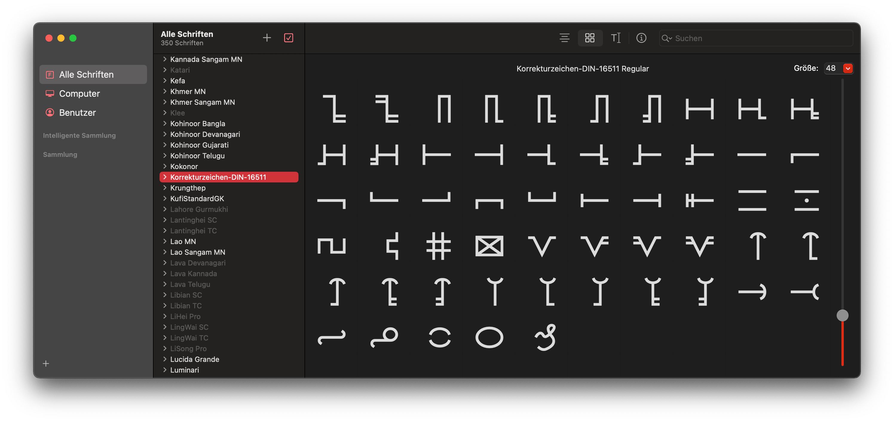
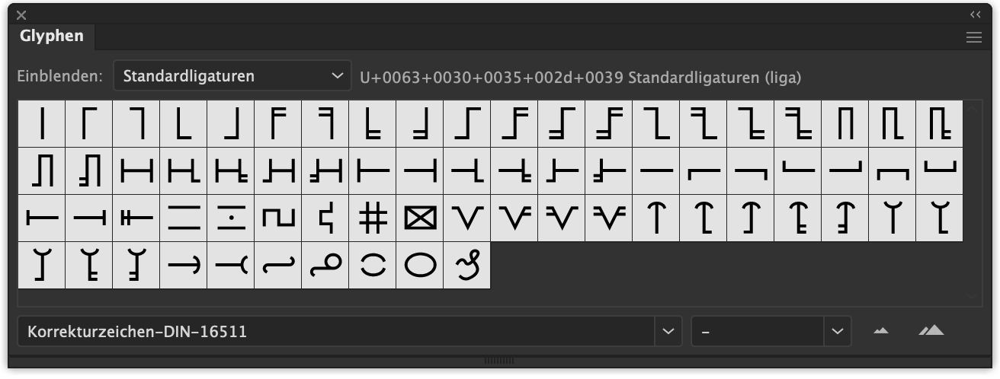

// :toc:

DIN 16511 regelt wie Textkorrekturen im deutschsprachig Raum zu kennzeichnen sind. Hier gibt es eine ganze Reihe an Korrekturzeichen um die unterschiedlichsten Fehler zu kennzeichnen. Diese Zeichen am Computer zu benutzen ist allerdings extrem lästig, da sie jedesmal frei Hand mithilfe von Zeichenwerkzeugen mühsam in den jeweiligen Programmen erstellt werden müssen. Deutlich bequemer wäre da eine Schrift, die einem die Zeichenarbeit abnimmt. +
Allerdings ist eine solche Font im Netz leider nirgends zu finden. Doch das ist jetzt vorbei. Frustriert von den Mühseligkeiten und angetrieben von zukünftiger Einfachheit habe ich mich der Aufgabe angenommen und die meist verwendeten deutschen Korrekturzeichen aus der DIN 16511 in digitaler Form erstellt und in einer Schrift (TrueType Font) zusammengeführt.

Dadurch das die Korrekturzeichen nun als digitale Font vorliegen, lassen sich diese übrigens nach Belieben einfärben und grenzenlos skalieren, ohne das es dabei zu irgendwelchen Qualitätsverlusten kommt. 😉

[.promo]
<<dl, Zum Download>>

== Verwendung
Bei der Verwendung der Schrift bestehen in erster Linie drei mögliche Wege die Korrekturzeichen in deinen Dokumenten einzufügen, welche ich dir an dieser Stelle gerne kurz vorstellen möchte.

=== Glypen
Der wohl schnellste und einfachste Weg das gewünschte Korrekturzeichen einzufügen ist das sogenannte _Glyphenbedienfeld_ mit ausgewählter Schrift zu benutzen. Im Programm Adobe Illustrator^®^ findest du dies zum Beispiel unter `Schrift > Glypen`.

=== Ligaturen
Die einzelnen Korrekturzeichen sind darüber hinaus auch über Ligaturen erreichbar. Hierzu legst du zunächst die Schrift `Korrekturzeichen-DIN-16511` fest, dann tippst du eine Zeichenkombination der <<table, Tabelle>> weiter unten ein und das verwendete Programm verwandelt diese dann automatisch in das hinterlegte Korrekturzeichen.

Wenn du die automatische Umwandlung der Ligaturen in die Korrekturzeichen in Microsoft Word^®^ verwenden möchtest solltest du zunächst überprüfen ob das entsprechende Feature aktiviert ist. Stelle dazu sicher das unter dem Menüpfad `Format > Schriftart > Erweitert > Erweiterte Typografie` die Option `Ligaturen` auf `Alle` gesetzt ist.

=== Kopieren
Das schlichte Kopieren und Einfügen der Korrekturzeichen mithilfe der bekannten Tastenkombinationen `⌘ + C` und `⌘ + V` bzw. `STRG + C` und `STRG + V` ist ebenfalls eine denkbare Verwenungsmethode.

+++

+++

== Zeichensatz
Sofern du dir die Schrift bereits über den Link am Seitenende heruntergeladen und installiert hast, dürftest du in der nachstehenden Tabelle alle Korrekturzeichen des Schriftsatzes sehen, und anhand der Kopiervorlage diese Unicodes auch frei auf deinem Rechner kopieren und einfügen können. Befindet sich die Schrift hingegen noch nicht auf deinem Computer dürften dich ganz viele `⍰` erblicken. 🙃

// [.gcmf, id=table, cols="^.^10%, >.^15%, ^.^15%, <.<60%"]
// [.gcmf, id=table, cols="10%, 15%, 15%, 60%"]
[.gcmf, id=table]
|===
| № | Ligatur | Zeichen | Bedeutung

.9+| 1
| c01-1
| 
.9+| Einzelnes Zeichen für Ersatz oder Löschung kennzeichnen
| c01-2
| 
| c01-3
| 
| c01-4
| 
| c01-5
| 
| c01-6
| 
| c01-7
| 
| c01-8
| 
| c01-9
| 

.4+| 2
| c02-1
| 
.4+| Absatz einfügen
| c02-2
| 
| c02-3
| 
| c02-4
| 

.4+| 3
| c03-1
| 
.4+| Wortzwischenraum einfügen
| c03-2
| 
| c03-3
| 
| c03-4
| 

.5+| 4
| c04-1
| 
.5+| Zeichenreihenfolge umkehren
| c04-2
| 
| c04-3
| 
| c04-4
| 
| c04-5
| 

.11+| 5
| c05-1
| 
.11+| Zeichenfolge für Ersatz oder Löschung kennzeichnen
| c05-2
| 
| c05-3
| 
| c05-4
| 
| c05-5
| 
| c05-6
| 
| c05-7
| 
| c05-8
| 
| c05-9
| 
| c05-10
| 
| c05-11
| 

.7+| 6
| c06-1
| 
.7+| Texteinzug am Zeilenbeginn löschen
| c06-2
| 
| c06-3
| 
| c06-4
| 
| c06-5
| 
| c06-6
| 
| c06-7
| 

| 7
| c07-1
| 
| Texteinzug Zeilenbeginn löschen

| 8
| c08-1
| 
| Texteinzug am Zeilenende löschen

| 9
| c09-1
| 
| Zeile einfügen

| 10
| c10-1
| 
| Verrutscht Zeile kennzeichen

| 11
| c11-1
| 
| Punkt vertikal zentrieren

| 12
| c12-1
| 
| Wörterreiehnfolge umkehren

| 13
| c13-1
| 
| Ausschuss löschen

| 14
| c14-1
| 
| Zeichen(folge) blockieren

| 15
| c15-1
| 
| Einzug einfügen

.4+| 16
| c16-1
| 
.4+| Zeichenfolge einschieben
| c16-2
| 
| c16-3
| 
| c16-4
| 

.5+| 17
| c17-1
| 
.5+| Zwischenraum verringern
| c17-2
| 
| c17-3
| 
| c17-4
| 
| c17-5
| 

.5+| 18
| c18-1
| 
.5+| Zwischenraum vergrößern
| c18-2
| 
| c18-3
| 
| c18-4
| 
| c18-5
| 

| 19
| c19-1
| 
| Zeilenabstand bzw. Durchschuss verringern

| 20
| c20-1
| 
| Zeilenabstand bzw. Durchschuss vergrößern

| 21
| c21-1
| 
| Zeilen verbinden, Umbruch löschen

| 22
| c22-1
| 
| Worttrennung verbessern

| 23
| c23-1
| 
| Zwischenraum löschen, zusammenschreiben

| 24
| c24-1
| 
| Unleserlichkeit/Beschädigung kennzeichen

| 25
| c25-1
| 
| Makierung tilgen/löschen (Deleaturzeichen)
|===

[#dl]
== Download
Die `ttf`-Datei kannst du dir auf deinem PC oder Mac für ein einmaligen Preis von 5,00€ als Desktop-Font herunterladen, installieren und gleich loslegen (weiteres zur <<licence, Lizenzierung>>). Nach der Bezahlung per PayPal wird dir sofort automatisiert dein sicherer Download-Link zugestellt.

Ich wünsche dir viel Freude mit der Font und stehe dir bei Komplikationen selbstverständlich jederzeit zur Verfügung. 😃

[.promo]
https://store.wolf.gdn/b/WFwPq[Jetzt erwerben]

== Versionen

=== 2.2
* Korrektur von Zeichen №20
* Vereinheitlichte Bezeichnungen für Ligaturen: `c{Zeichen}-{Variante}`, wobei `{Zeichen}` für die Nummer des Korrekturzeichens (`01`–`25`) und `{Variante}` für die Nummer einer der verfügbaren Varianten (`1`–`9`) des Zeichens steht

=== 2.1
* Erweiterung des Umfangs auf insgesamt 70 Zeichen
* Einzelne Zeichen lassen sich jetzt durch Aneinanderreihung zu mehrere Zeichen langen Konstrukten kombinieren

=== 2.0
* Erweiterung des Umfangs auf insgesamt 64 Zeichen
* Neues Ordnungssystem für Ligaturen

=== 1.0
- Umfang von insgesamt 29 Zeichen
- Ligaturen von `01` bis `29`

== Lizenz
[#licence]
Mit dem Erwerb bekommst du die Lizenz zur Verwendung der Font auf deinem Computer. Du darfst die Schrift in all deinen Programmen für private und auch kommerzielle Zwecke nutzen. Darin inbegriffen ist die Nutzung der Font in Dokumenten und statischen Bildern, diese dürfen komplett frei online und auf ausgedrucktem Gut eingesetzt werden.

+++
include::content/posts/_/korrekturzeichen/jsonld.html[]
+++
// include::content/posts/misc/korrekturzeichen/jsonld.html[]
// include::content/misc/korrekturzeichen/jsonld.html[]
// include::content/fonts/korrekturzeichen/jsonld.html[]