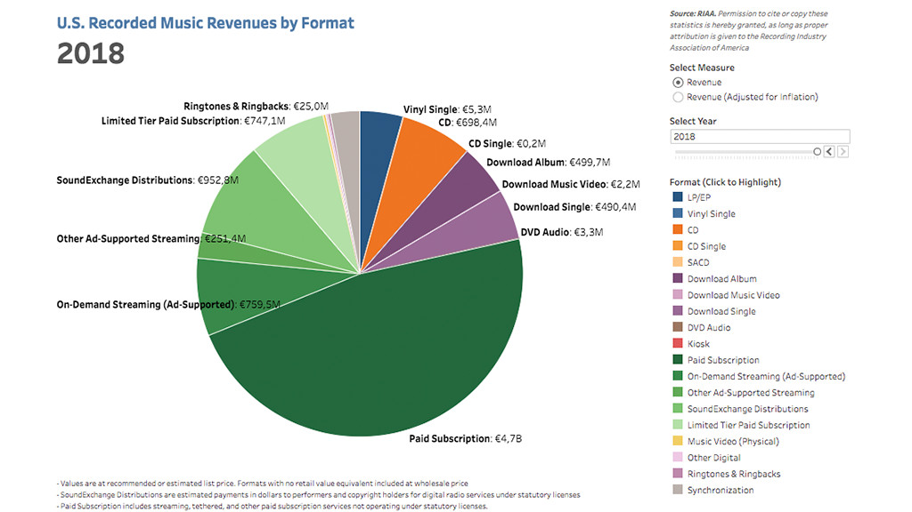

// = Audio in der Videoproduktion
// David Wolf <david@wolf.gdn>
// :toc:
// :toc-title: Inhalt
// :title-page:
// AudioInDerVideoproduktion Mg9 David

== 1. Das menschliche Ohr

=== 1a. Wie ist der Weg von der Tonerzeugung hin zur bewussten Wahrnehmung dieses Tons im menschlichen Gehirn?

[quote, MED-EL Medical Electronics, 'https://www.medel.com/de-at/about-hearing/how-hearing-works[Wie funktioniert Hören]']
____
Außenohr:: Töne und Geräusche gelangen in Form von Schallwellen durch unser Außenohr zum Mittelohr. Da Schallwellen nichts anderes als Vibrationen sind, bringen Sie im Mittelohr das Trommelfell zum Vibrieren.
Mittelohr:: Das Trommelfell bringt die Gehörknöchelchen, winzige Knochen im Mittelohr, zum Schwingen. So werden die Schallvibrationen an das Innenohr übertragen.
Innenohr:: Wenn die Schallvibrationen die Cochlea erreichen, versetzen sie dort die sogenannten Haarzellen in Schwingung. Diese wandeln die Vibrationen in elektrische Nervenimpulse um.
Hörnerv:: Der Hörnerv verbindet die Cochlea mit jenen Bereichen im Gehirn, die  für das Hören zuständig sind. Erst wenn Impulse über den Hörnerv zum Gehirn gelangen, können sie als Klänge wahrgenommen werden.
____

=== 1b. Welche Fähigkeiten hat das menschliche Gehör, sammeln Sie mindestens 6 wichtige Eigenschaften.
. Schallwellen weiterleiten
. Weitergeleitetes interpretieren
. Speicherung von Interpretierten
. Identifikation und Unterscheidung von Interpretiertem und Gespeicherten 
. link:https://wol.jw.org/de/wol/d/r10/lp-x/101975404#h=13[Lautstärke senken]
. https://wol.jw.org/de/wol/d/r10/lp-x/101975404#h=14[Schutz vor Platzem des Trommelfells bei Veränderung des Luftdrucks]

=== 1c. Welche Erkenntnisse haben Sie über Hörschäde?

.Ursachen
[quote, NetDoktor, 'https://www.netdoktor.de/symptome/schwerhoerigkeit/#:~:text=Verstopfter%20Geh%C3%B6rgang%2C%20etwa,Fensterruptur[Ursachen einer Schallleitungs-Schwerhörigkeit]']
____
* Verstopfter Gehörgang, etwa durch Ohrenschmalz (Cerumen) oder Fremdkörper
* Angeborene Fehlbildungen des Gehörgangs
* Tumore im Gehörgang oder Mittelohr
* Verletzungen
* Knochenwucherungen (z. B. bei Schwimmern verbreitet)
* Belüftungsstörung und Flüssigkeitsansammlung im Mittelohr (Paukenerguss)
* Akute oder chronische Mittelohrentzündung
* Entzündung der luftgefüllten Nebenräume im Mittelohr (Mastoiditis)
* Otosklerose: Hier ist ein Gehörknöchelchen, der Steigbügel, mit dem Knochen verwachsen.
* Trommelfellperforation
* Schädelbasisbruch
* Fehlbildungen im Mittelohr
* Fensterruptur
____

== 2. Akustische Grundlagen
=== 2a. Definieren Sie, was ein Ton ist!
[quote, Oxford Languages, 'https://www.google.com/search?q=define+der+ton']
vom Gehör wahrgenommene gleichmäßige Schwingung der Luft, die (im Unterschied zum Klang) keine Obertöne aufweist

=== 2b. Grenzen Sie die Begriffe Raumakustik und Hörakustik voneinander ab.
Raumakustik:: befasst sich mit der Akustik innerhalb eines Raumes, z. B. in einem Gebäude
Hörakustik:: hingegen befasst sich mit der Autistik des Hörens am Menschen selbst

=== 2c. Definieren Sie die Begriffe: Amplitude, Periodendauer, Frequenz und Dynamik im Zusammenhang eines Audiosignals.

Amplitude:: Veränderung des Lautstärke-Pegels von einer Schwingung zur nächsten.
Periodendauer:: Die Dauer einer Schwingung.
Frequenz::
+
[quote, 'PREFORM', 'https://www.preform.de/frequenz/[Frequenz]'] 
Die Frequenz bezeichnet die Anzahl der Schwingungen je Sekunde, die bei einem Ton vorhanden sind.
Dynamik:: 
+
[quote, fairaudio, 'link:https://www.fairaudio.de/lexikon/dynamik/#:~:text=Die%20Dynamik%20gibt%20das%20Verh%C3%A4ltnis%20zwischen%20lautestem%20und%20leisestem%20Schalldruckpegel%20an.[HiFi-Lexikon: Dynamik, Dynamikumfang]']
Die Dynamik gibt das Verhältnis zwischen lautestem und leisestem Schalldruckpegel an.

== 3. Audiodigitalisierung

=== 3a. Wie verläuft das Verfahren der Samplingrate und Quantisierung während der Audiodigitalisierung. Beschreiben Sie in kurzen Stichworten.
* In dem Umfang/der Häufikeit der festgeleten _Samplingrate_ wird das Audio entsprechend abgetastet
* Zusätzlich kommt es hier auf die _Samplingtiefe_ an, welche die Feinheit der Erfassung reguliert
* Bei der Quantisierung werden die empfangenen Signale nun verarbeitet, siehe https://de.wikipedia.org/wiki/Quantisierung_(Signalverarbeitung)[Quantisierung (Signalverarbeitung)]
* der Analog-Digital-Umwanlder verwendet die erfassten Informationen zum umschreiben des Audios

=== 3b. Wie lautet das Shannon Theorem?
[source]
----
Datenrate = Bandbreite * log2(SignalRauschVerhältnis + 1)
----
Quelle: https://www.itwissen.info/Shannon-Theorem-shannon-theorem.html[itwissen.info]

== 4. Mikrofonie
=== 4a. Welche unterschiedlichen Richtcharakteristika bei Mikrofonen gibt es?
* Kugel
* Acht
* Keule
* Breite Niere
* Niere
* Superniere
* Hyperniere

Quelle: https://de.wikipedia.org/wiki/Richtcharakteristik#Mikrofone[wikipedia.org]

=== 4b. Welchen unterschiedlichen Aufbau, welche Funktionen und Einsatzgebiete haben Kondensatormikrofone im Vergleich zu dynamischen Mikrofonen?

|===
| Mic | Aufbau | Funktion, Einsatz

| Kondensatormikrofone
| Schall zu Spannung mittels Membran +
  (Aufnahmen klingen klarer)
a|
* bei Aufnahmen, die detailiert wiedergegeben werden sollen
* bei Tonquellen, die weiter entfernt sind

| Dynamische Mirkofone
| Schall zu Spannung mittels Schwingspule
a|
* bei hohen Schalldruckpegeln
* im Nahbereich
|===

Quelle: https://www.lewitt-audio.com/de/blog/dynamische-vs-kondensator-mikrofone-was-ist-besser[lewitt-audio.com]

== 5. Tongestaltung
=== 5a. Welche Möglichkeiten haben Sie eine Filmszene im Bezug auf Ton zu gestalten?
Eine Filmszene lässt sich durch Audio auf unterschiedliche Wege gestalten. Ein Weg kann beispielsweise die Untermalung mit Musik sein, die extra für die vorliegende Szene ausgewählt worden ist. Neben der musikalischen Hervorhebung spielen auch diverse SOund-Effekte eine Rolle. Sie verstäken und betonen das Geschehen. Hierbei ist auch nicht der natürliche Klang der gezeigten Umgebung zu vergessen. Allem voran steht hier selbstverständlich noch das Gesprochene, was Botschaft und Handlung letztendlich maßgeblich transportiert.

=== 5b. Welches sind die vier gestaltbaren Tonebenen?
. O-Ton
. Sound-Effekte
. Atmos
. Musik

Quelle: https://www.movie-college.de/filmschule/postproduktion/filmschnitt/tonebenen[movie-college.de]

=== 5c. Erklären Sie folgende Begriffe:
On-Töne:: Wenn du Ton-Quelle im Bild zu sehen ist
Off-Töne:: Wenn du Ton-Quelle nicht im Bild zu sehen ist
// Klang-Geräusch:: …
Tonreflexion:: Zurückwerfen von Schallwellen
Tonabsorption:: Verminderung von Schallenergie
Voiceover:: 
+
[quote, wikipedia.org, Voiceover]
____
[…] bezeichnet die Tonaufnahme einer Stimme (engl. voice), die über (engl. over) eine andere Tonaufnahme oder über eine Filmszene gelegt wird.
____
Loop:: Schleifen-Wiedergabe

== 6. Tontechnische Geräte und Formate
=== 6a. Zählen Sie die wichtigsten Hardwarekomponenten eines Tonstudios auf.
* Computer
* DAW
* Audio-Interface
* Mikrofone
* Kopfhörer
* Studio-Monitore
* Kabel
* Mikrofonständer
* Popschutz

Quelle: https://de.ehomerecordingstudio.com/tonstudio-equipment-uebersicht/[ehomerecordingstudio.com]

=== 6b. Was ist mp3?
[quote, wikipedia.org, MP3]
[…] ist ein Verfahren zur verlustbehafteten Kompression digital gespeicherter Audiodaten.

=== 6c. Was ist Dolby Surround und Dolby Digital?
Dolby Surround::
+
* Tonsystem
** Analog
** Mehrkanal-basiert
* Einsatz im Heimbereich
* Schafft es aus 4 Tonkanälen 2 Tonspuren zu machen (Matrixkodierung)
Dolby Digital::
+
* Tonsystem
** Mehrkanal-basiert
* Einsatz in
** Kino
** DVD
** Blu-ray
** …
* Patent abgelaufen

== 7. Streaming
=== 7a. Unterschiede Download, Live-Streaming, On-demand-Streaming
Download:: Herunterladen von Videodaten, muss erst heruntergleaden werden
Live-Streaming:: Echtzeit Übertragung von Videodaten, keine Veränderung der Timeline möglich, da live
On-demand-Streaming:: Übertragung und Wiedergerabe von einem onlien Anbieter, Veränderung der Timeline möglich: Pause, Spulen, etc.

=== 7b. Aktueller Markt der Streaming Dienste

Quelle: https://www.riaa.com/[riaa.com]

=== 7c. Technisches Prinzip
Kleine Segmenete der Videodaten werden in Paketen über Netzwerk-Protokolle über das Internet geschickt. 

Die Übertragung rechnet ein Buffer ein, sodass bei kurzweiligen Verbindungsverlust der Stream weiterläuft. 

Zu keinem Zeitpunkt befindet sich das vollständige Video-Material auf dem Endgerät des Streaming-Client, lediglich immer die kleinen Segment-Pakete.

=== 7d. Legalität - Iilegalität
(Bezahlte) Anbieter, die das Videomaterial durch die Ersteller lizensiert halten sind legal, während anderswo angebotenes Material unter Copyright-Verletzungen fallen kann, da kein lizensiertes Angebot besteht, die Verbreitung findet unkontrolliert ohne Aufsicht und Beteiligung des Urhebers statt, dass ist illegal.

== 8. Videodaten
=== 8a. Datenmenge und Datenrate
Datenmenge:: Dateigrößen, Anteil an Speicherplatz der zum Ablegen der Daten erforderlich ist
Datenrate:: Rate der durchnittlichen Übertragung von Daten, lokal oder über Netzwerke

=== 8b. Einheiten und Umrechnung
.Einheiten
* Bit
* Byte
* KB
* MB
* GB
* PB

.Umrechnung
* Umrechung kann je nach Angabensystem mit dem Faktor `1000` oder `1024` erfolgen
* Besonderheit sind 8 Bit entsprechen einem Byte

=== 8c. Beispielrechnung
.Umrechnung Gigabyte zu Megabyte mit dem Faktor `1024`
----
1GB Video-Daten => 1024 MB Video-Daten
----

== 9. Videokompression
=== 9a. MPEG Verfahren
[quote, chip.de, MPEG]
MPEG-Dateien gehören zu einer Videoformat-Gruppe, die bewegte Bilder mittels Videokompression kompakt abspeichern.

=== 9b. Begriffe
[quote, wikipedia.org, 'https://de.wikipedia.org/wiki/Bildergruppe[Bildergruppe]']
____
GOP:: Bildergruppe
1-Frame:: Referenzbild
P-Frame:: […] enthält Differenz-Informationen aus dem vorhergehenden und/oder nachfolgenden […]-Bild
B-Frame:: […] enthält Differenz-Informationen aus dem vorhergehenden und/oder nachfolgenden […]-Bild
____

=== 9c. Color Subsampling
[quote, motioninsider.de, Farbunterabtastung]
Die Farbunterabtastung, auch chroma subsampling genannt, ist eine Technik zur Kompression, also zur Datenreduzierung von Videos. In dieser Technik werden die Helligkeitsunterschiede und Farbunterschiede des Bildes separat komprimiert.

== 10. Videokompression
=== 10a. Codecs und Formate/Container
Codec:: Kodierung, Werkzeug/Algorithmen zur Verkleinerung der Datenmenegen
Formate/Container:: Unterschiedliche Speichertechniken mit verschiedenen Schwerpunkten

=== 10b. Verfahrenstechniken
Räumliche Kompression:: Ähnliche, gleiche benachbarte _Bilder_ werden bei der Kompression vereint.
Zeitliche Kompression:: Ähnliche, gleiche benachbarte _Bildpunkte_ werden bei der Kompression vereint.
Verlustfreie Kompression:: Es _kommt nicht_ zum Verlust von Informkationen der Videodaten.
Verlustbehafete Kompression:: Es _kommt_ zum Verlust von Informkationen der Videodaten.

=== 10c. H264/H265
H264:: High-Efficiency Video Coding
H265:: Advanced Video Encoding